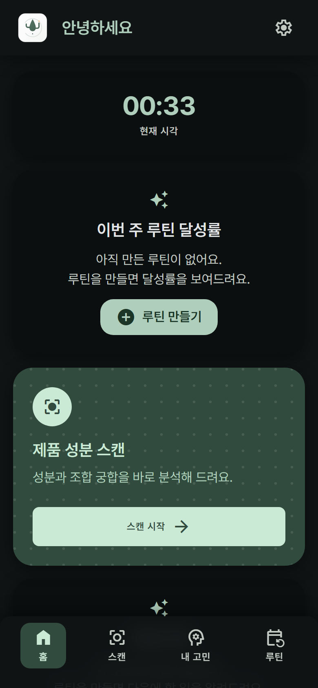
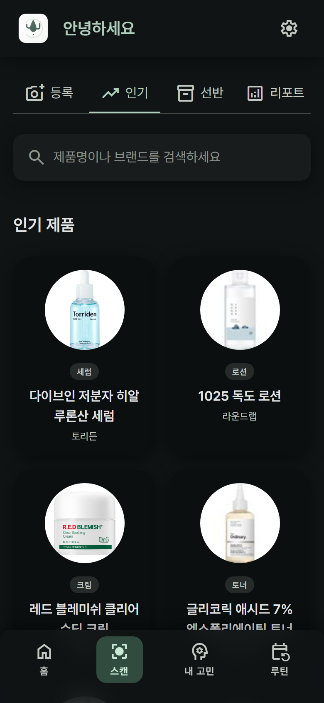
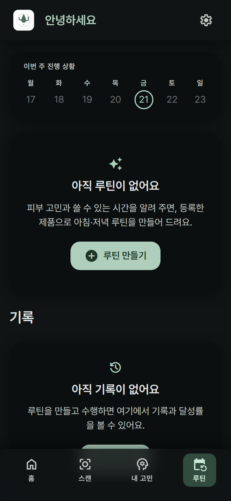
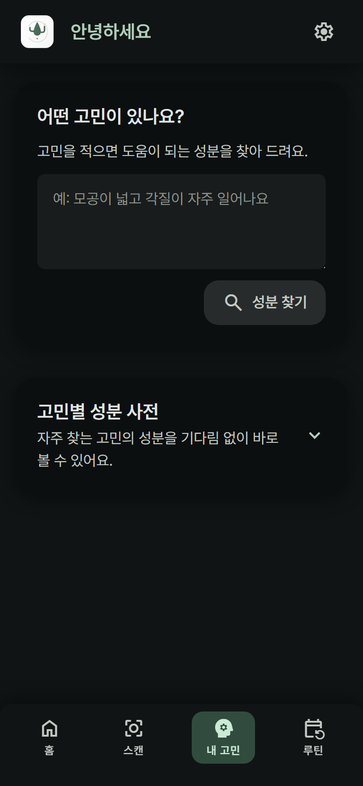

# 유틴 (youtine)

**내가 이미 가진 화장품만으로, 내 피부 고민과 쓸 수 있는 시간에 맞춘 스킨케어 루틴을 AI가 짜 주고 그대로 따라 하게 해 주는 앱.**

> 저장소·패키지 이름의 `al-front`("Animal League")는 초기 프로젝트명이 남은 것입니다. 서비스명은 유틴입니다.
>
> 배포 데모 주소와 테스트 계정은 제출 폼에 적었습니다. 이 저장소는 공개 기준으로 다루기 때문에 서버 주소를 커밋하지 않습니다([보안](#보안)).
>
> 로그인이 없습니다. 브라우저로 열면 바로 쓸 수 있습니다. 익명 쿠키로 사용자를 구분하므로 가입 절차 없이 전 기능을 확인할 수 있습니다.

---

## 1. 문제 — "안 사서" 실패하는 게 아니라 "못 써서" 실패한다

스킨케어 시장의 담론은 **무엇을 살까**에 쏠려 있습니다. 그런데 실제 실패는 **이미 산 것을 잘못 쓰는 데서** 납니다.

| 문제                               | 왜 개인이 못 푸는가                                                                                           |
| ---------------------------------- | ------------------------------------------------------------------------------------------------------------- |
| **정보는 넘치는데 내 것이 아니다** | 유튜브·블로그 루틴은 **그 사람이 가진 제품** 기준. 내 화장대엔 절반이 없다                                    |
| **성분 충돌을 판단할 수 없다**     | 레티놀과 AHA를 같은 밤에 쓰면 안 된다는 걸 알려면, 제품 뒷면 **전성분 수십 종**을 읽고 상호작용을 알아야 한다 |
| **시간이 없다**                    | 아침 3분 쓰는 사람에게 7단계 루틴은 **지키지 못할 계획**                                                      |

### 이 문제가 실재한다는 근거 (이 저장소의 실측치)

가설이 아니라 **실제 데이터로 확인된 것**만 적습니다.

- **전성분은 사람이 읽을 양이 아니다** — 실제 등록된 제품의 전성분 수: 디오디너리 AHA 토너 **47종**, 웰라쥬 앰플 **56종**, 이니스프리 레티놀 앰플 **36종**. 제품 3개만 써도 **139종**을 대조해야 충돌을 안다.
- **제품 정보는 개인이 모으기 어렵다** — 카탈로그 29개 중 이름만으로 성분을 특정할 수 있었던 것은 **16개(55%)** 뿐. 나머지는 성분표 사진이나 제조사 표기가 있어야 알 수 있었습니다. 사람이 매번 이걸 하지 않습니다.
- **충돌·시너지는 개별 성분이 아니라 조합의 문제** — 이 앱의 지식 DB에 담긴 성분 상성 규칙 **40건**(시너지 20 · 충돌 20), 고민·피부타입별 효능 **63건**. 조합 수는 제품이 늘수록 제곱으로 늘어납니다.

### 타깃에게 직접 물어본 것

2026년 8월, 고기능성 화장품을 두 가지 이상 섞어 쓰는 20~30대 27명을 인터뷰했습니다.

- 24명(88.9%)이 성분 충돌을 걱정하고 있었습니다. "레티놀이랑 비타민C 같이 쓰면 뒤집어질까 봐 불안해요."
- 20명(74.1%)은 자기가 쓰는 제품에 뭐가 들었는지 모른다고 답했습니다. "좋다는 건 샀는데 왜 좋은지는 몰라요."
- 사 놓고 안 쓰는 화장품이 있다는 응답이 74.1%, 아침에 스킨케어에 쓸 수 있는 시간은 대체로 3~5분이었습니다.

27명은 통계로 내세울 표본은 아닙니다. 다만 위 실측치와 방향이 같아서, 문제를 잘못 짚은 것은 아니라고 보고 있습니다.

### 타깃

**화장품을 이미 여러 개 갖고 있고, 순서·궁합·시간 때문에 매일 헤매는 사람.** 새로 살 것을 고르는 사람이 아닙니다.

### 솔루션 한 줄

> 가진 제품을 등록하면, AI가 **성분 충돌을 피하고 내 가용 시간 안에 끝나는** 아침·저녁 루틴을 짜고, 단계별 타이머로 그대로 따라 하게 한다.

## 2. 왜 다른가 (차별적 새로움)

| 기존 웰니스·뷰티 서비스             | 유틴                                                                                               |
| ----------------------------------- | -------------------------------------------------------------------------------------------------- |
| **무엇을 살지** 추천 (커머스 연결)  | **가진 것만으로** 짠다 — 프롬프트가 "제공된 products만 사용"을 강제. 없는 제품은 만들어내지 않는다 |
| 성분 정보를 **백과사전처럼** 보여줌 | **내 선반 조합**을 분석 — 내가 가진 제품끼리의 충돌·시너지만 리포트                                |
| 루틴을 **콘텐츠로** 제공            | 루틴을 **실행**시킴 — 단계별 타이머·사용법 체크리스트·수행 기록                                    |
| 시간 개념 없음                      | **시간 예산**을 지킴 — "아침 3분"이면 3분 안에 끝나는 단계 수로 조절                               |
| 모르면 **그럴듯하게 답함**          | 모르면 **모른다고 함** — 근거 없으면 빈 배열, 화면은 "성분표 사진을 올려 주세요"로 이어짐          |

### 설계 원칙 — "지어내지 않는다"

이 앱의 신뢰는 **AI가 모르는 것을 모른다고 말하게 만드는 것**에 달려 있습니다. 프롬프트와 코드 양쪽에서 강제합니다.

- **없는 제품을 추천하지 않는다** — 루틴 생성 규칙 3: "제공된 products만 사용"
- **성분을 지어내지 않는다** — 근거가 없으면 빈 배열. **빈 응답은 실패가 아니라 정상 계약**입니다
- **의학적 진단을 하지 않는다** — 증상이 심하면 피부과 상담 권고를 넣도록 규칙화(규제 리스크 회피)
- **근거 없는 숫자를 띄우지 않는다** — 수행 기록이 없으면 달성률을 "0%"가 아니라 "아직 기록 없음"으로 구분

## 3. 일상 밀착도 — 하루 두 번, 실제로 쓰는 자리

이 앱은 **아침과 저녁 세면대 앞**에서 켜집니다. 그 맥락에 맞춰 만든 것들:

- **수행 화면이 손이 젖은 상태를 전제** — 제품 사진 위 큰 타이머(탭 한 번으로 일시정지), 큰 다음 버튼, 스크롤하면 하단 고정 바로 이어짐
- **매일 반복을 기록** — 주간 스트립·달성률이 수행 기록에서 자동 계산(손으로 체크하는 가짜 상태가 아님)
- **제품이 바뀌면 루틴도 바뀜** — 선반이 바뀌면 리포트 지문이 바뀌어 "다시 분석" 버튼이 나타남
- **로그인 없음** — 세면대 앞에서 비밀번호를 치지 않습니다

## 4. 실현 가능성 — 배포되어 실제로 돕니다

핵심 기능이 **전부 프로덕션에 배포돼 동작 중**입니다. 아래는 배포 환경 실측치입니다.

| 기능                 | 상태    | 실측                                                                              |
| -------------------- | ------- | --------------------------------------------------------------------------------- |
| 제품 등록(이름·사진) | ✅ 동작 | 카탈로그 히트 **0초** / 공식몰 **0.1–0.4초** / AI 추출 사진 14–54초·이름 56–110초 |
| AI 루틴 생성         | ✅ 동작 | 60–90초, 시간 예산·성분 충돌 규칙 검증 통과                                       |
| 루틴 수행·기록       | ✅ 동작 | 단계별 타이머, 수행 기록 7건 누적                                                 |
| 성분 리포트          | ✅ 동작 | 선반 지문(SHA-256) 캐시로 재분석 비용 0                                           |
| 고민별 성분 추천     | ✅ 동작 | DB 캐시 히트 시 수백 ms                                                           |

실제 축적된 데이터(2026-08-21 운영 DB 직접 조회): **제품 29개 · 성분 지식 103건**(성분 상성 40 + 고민·타입별 효능 63) **· 사용자 34명 · 선반 48건 · 루틴 12개 · 수행 기록 7건**

> 성분 지식 103건 중 **3건은 시드가 아니라 실제 사용자의 선반 분석에서 자동 수확된 것**입니다.
> 쓸수록 지식이 쌓이는 구조가 데모가 아니라 실제로 돌고 있다는 뜻입니다(§5 네트워크 효과).

### 운영 성숙도

기능뿐 아니라 **장애를 견디는 구조**까지 만들었습니다 — 실제로 겪은 장애들이 근거입니다.

- **외부 의존이 죽어도 서비스가 산다** — 제품 검색 소스(화해)가 장애일 때, 자체 카탈로그 검색으로 후보를 계속 제공하고 "더 깊게 검색" 경로로 등록을 이어갑니다. _(2026-08-20 외부 오리진 500 장애를 이 구조로 흡수)_
- **AI 인증 만료 자동 감지** — `/api/health/ai` 가 실제 호출로 상태를 확인하고 `reason:"auth"` 를 구분해 알립니다(장애를 사용자 신고로 알았던 경험에서 추가)
- **네트워크가 끊겨도 기록이 어긋나지 않는다** — 수행 기록 저장은 **멱등**합니다. 서버에 저장됐는데 응답만 유실되는 상황에서 재시도가 같은 기록을 두 번 쌓으면 달성률이 부풀려지는데, 자연키로 한 건에 수렴시킵니다
- **CI 성공 후에만 배포** — 포맷·린트·타입·**테스트**·빌드 + 시크릿 스캔을 통과해야 이미지가 나갑니다. 배포 게이트는 **저장소 소유 브랜치의 푸시로 돈 CI 만** 인정합니다(포크 PR 이 배포를 발동시키지 못하게)
- **DB 백업** — `db/backup.sh` (덤프 무결성 검증 + 보관 정책). 비밀번호를 프로세스 인자로 넘기지 않아 같은 호스트의 `ps` 에 노출되지 않습니다
- **스키마 변경은 번호 붙은 마이그레이션으로만** — `db/migrations/001~007`, 적용 이력은 `schema_migrations` 테이블이 들고 있습니다

## 5. 시장성

**핵심 자산은 "공유 제품 카탈로그"** 입니다. 사용자가 제품을 등록할수록 다음 사용자의 등록이 빨라지고 정확해집니다(현재 29개 → 등록 1건마다 누적). 이건 경쟁자가 복제하기 어려운 **네트워크 효과**입니다.

| 수익 모델               | 설명                                                                                              | 현재 상태                          |
| ----------------------- | ------------------------------------------------------------------------------------------------- | ---------------------------------- |
| **Pro 구독**            | 무료는 루틴 2세트(기본·기타). 상황별 루틴(생리 주기·환절기·여행) 추가는 Pro                       | UI에 상한·안내 구현됨(결제 미연동) |
| **성분 기반 제품 제안** | "이 고민에 도움되는 성분이 든 제품" — 이미 내 선반에서 찾아주는 기능이 있고, 여기에 커머스를 연결 | 기능 동작 중(수익화 미연동)        |
| **브랜드 인사이트**     | 어떤 성분 조합이 어떤 고민과 함께 등록되는지 — 익명 집계                                          | 데이터 축적 중                     |

### 1차 연도 목표

| 구간 | 잡은 근거                                      | 규모     |
| ---- | ---------------------------------------------- | -------- |
| TAM  | 국내 20~30대 기초·기능성 화장품 소비자         | 650만 명 |
| SAM  | 그중 고기능성 성분을 2종 이상 함께 쓰는 사람   | 130만 명 |
| SOM  | SAM의 5%에 도달(6.5만 명), 그중 5%가 유료 전환 | 3,250명  |

연 구독료 39,000원(월 3,900원을 연간 결제하는 기준)으로 계산하면 1차 연도 매출은 1억 2,675만 원입니다.
인터뷰에서 유료 구독 의향은 80%로 나왔지만 말과 결제는 다르므로 전환율은 5%로 낮춰 잡았습니다.

확장 축은 **피부 → 몸·마음의 웰니스 루틴**입니다. "가진 것으로, 가능한 시간 안에, 충돌 없이"라는 구조는 영양제·운동 루틴에 그대로 옮겨집니다.

## 6. 화면

| 홈                                          | 스캔                                        | 루틴                                   | 내 고민                                      |
| ------------------------------------------- | ------------------------------------------- | -------------------------------------- | -------------------------------------------- |
|             |           |   |      |
| 다음에 할 루틴, 주간 달성률, 성분 주의 알림 | 제품 등록 / 인기 / 내 선반 / AI 분석 리포트 | 기본·기타 루틴, 주간 스트립, 수행 기록 | 고민 등록 → 도움 성분 → 그 성분이 든 내 제품 |

> 라이트·다크 모드를 모두 지원합니다(설정에서 전환, OS 설정도 따름). 위는 다크 모드 화면입니다.

## 7. 아키텍처

```
                     브라우저 (Next.js App Router · CSS Modules)
                                    │  같은 오리진 /api/*  (CORS 불필요)
                                    ▼
        ┌───────────── Next.js Route Handlers (src/app/api/**) ─────────────┐
        │                                                                   │
        │   /api/products  /api/routines  /api/runs  /api/knowledge/*       │
        │        │                                        │                 │
        │        ▼                                        ▼                 │
        │   ┌─────────┐   캐시 히트 → AI 호출 없음    ┌──────────┐          │
        │   │ MariaDB │◄──────────────────────────────│  /api/ai │          │
        │   └─────────┘   캐시 미스만 ─────────────►  └────┬─────┘          │
        └───────────────────────────────────────────────────┼───────────────┘
                                                            ▼
                                            헤드리스 Claude (`claude -p`)
                                            구독 인증 · 자식 프로세스 · JSON only
```

**별도 백엔드 서버가 없습니다.** 프론트·백엔드·DB 접근을 한 저장소에서 만듭니다.

### 성분을 얻는 경로 — 비싼 것을 뒤로 미룬다

```
① DB 카탈로그        0초      이미 누가 등록한 제품(가장 정확 — 실제 성분표에서 추출됨)
② 브랜드 공식몰      0.1–0.4초  제조사의 화장품법상 전성분 표기
③ 헤드리스 Claude    14–54초   성분표 사진을 올렸을 때(사진을 그대로 읽는다)
③' 헤드리스 Claude + 웹  56–110초  위가 다 실패했을 때 — 이름만으로 찾아야 하므로 웹을 연다
```

③과 ③'을 나눈 이유가 이 앱의 핵심입니다. **사진이 있으면 웹을 열지 않습니다** — 사용자가 내민 성분표가 최우선 근거인데 웹까지 열면 모델이 사진 대신 검색 결과를 섞습니다. 반대로 **이름만 있으면 반드시 웹을 엽니다.**

> 2026-08-21 실측: 이름만으로 성분을 뽑을 때 웹 도구가 없으면 **28건 중 4건(14%)** 만 성공했고 그마저 주요 성분 몇 개뿐이었습니다(구달 청귤 세럼 **3종**). 웹을 열자 **61%** 로 올랐고 목록도 실제 전성분 규모가 됐습니다(같은 제품 **63종**). 부분 목록이 더 위험합니다 — 화면에는 채워진 것처럼 보이면서 빠진 성분의 충돌은 검사되지 않기 때문입니다.

성분표 **사진이 있으면 ①②를 건너뛰고 바로 ③** 입니다 — 사용자가 자기 제품의 성분표를 내밀었다면 그게 최우선 근거이기 때문입니다(리뉴얼 제품은 카탈로그와 다를 수 있음).

**②에는 관문이 하나 더 있습니다.** 공식몰에서 찾아온 상세 페이지가 정말 그 제품인지 제목으로 대조한 뒤에만 성분을 받습니다. 이름이 비슷한 다른 제품의 전성분을 그 제품 것인 양 저장하면, 그 성분이 충돌 분석의 입력이 되고 **공유 카탈로그를 통해 다른 사용자에게도 나갑니다.** 확인이 안 되면 버리고 ③으로 넘깁니다 — 이 앱에서는 **틀린 성분이 빈 성분보다 나쁩니다.**

### AI 계층에서 신경 쓴 것

| 주제          | 무엇을 했나                                                                                                                                            |
| ------------- | ------------------------------------------------------------------------------------------------------------------------------------------------------ |
| **비용**      | AI 엔드포인트 5종을 **DB 우선**으로 전환. 고민 추천은 사용자별 캐시, 리포트는 선반 지문(SHA-256) 캐시, 성분은 공유 카탈로그 우선                       |
| **속도**      | 제품 검색을 LLM 웹 도구(18–37초) 대신 **서버가 검색 페이지를 직접 파싱**(0.5–2초). 실패 시 자동 폴백                                                   |
| **계약 검증** | 프롬프트 원문(`src/lib/prompts/*.ts`)이 정본. LLM은 스키마를 보장하지 않으므로 **런타임 검증**을 별도로 두고, 규칙 위반은 크래시가 아니라 경고 후 진행 |
| **동시 실행** | 사용자당 동시 1건 가드(429). 주의사항 생성은 사용자를 막지 않도록 **서버 백그라운드 직렬 큐**로 분리                                                   |
| **개인정보**  | API 키 없이 구독 인증. 성분표 사진이 남는 세션 트랜스크립트를 **모든 실패 경로에서** 삭제                                                              |

### 저장소 구조

```
src/
├─ app/                      App Router (폴더 = URL 경로)
│  ├─ (home)/                홈 — 다음 단계·달성률·성분 알림
│  ├─ scan/                  제품 등록 · 인기 · 내 선반 · AI 리포트
│  ├─ routine/               루틴 목록 · 생성 · 수행([routineId]/[step]) · 완료
│  ├─ concern/               내 고민 → 도움 성분 → 관련 제품
│  ├─ api/                   ⭐ 백엔드. Route Handler
│  │  ├─ ai/                 성분추출·루틴·주의사항·고민성분·리포트·제품검색
│  │  ├─ health/ai/          AI 인증·응답 상태 점검(운영)
│  │  └─ products/ routines/ runs/ profile/ knowledge/ migrate/
│  ├─ globals.css            전역 리셋 + 디자인 토큰(라이트/다크)
│  └─ icon.svg               파비콘
├─ components/               여러 라우트가 공유하는 UI
├─ lib/
│  ├─ prompts/               ⭐ 프롬프트 원문 = AI 계약의 정본
│  ├─ claude/                헤드리스 CLI 러너 · 응답 봉투 파싱
│  ├─ ingredients/           브랜드 공식몰 전성분 어댑터
│  ├─ ai/                    동시 실행 가드 · 주의사항 백그라운드 큐
│  ├─ db/                    커넥션 풀 · 입력 상한 · 행 매핑
│  └─ data.ts                SWR 데이터 계층(쓰기 후 캐시 무효화 규칙)
├─ api/                      브라우저 → /api/* 호출 래퍼
└─ types/                    도메인 타입
db/migrations/               스키마 001~005
docs/plans/                  설계 결정 기록
```

## 8. 기술 스택

| 영역   | 선택                                                                 |
| ------ | -------------------------------------------------------------------- |
| 프론트 | Next.js 16 (App Router, Turbopack) · React 19 · TypeScript 5.9       |
| 스타일 | **CSS Modules 전용** + `globals.css` 디자인 토큰(라이트/다크 팔레트) |
| 상태   | SWR (서버 데이터) · localStorage (기기별 임시 상태)                  |
| 백엔드 | Next.js Route Handlers · MariaDB (mysql2)                            |
| AI     | 헤드리스 Claude Code CLI (`claude -p`, 구독 인증)                    |
| 배포   | GitHub Actions → Docker Hub → 단일 EC2 (Docker Compose + nginx TLS)  |

### 왜 최신 버전이 아닌 것들이 있나

| 패키지      | 채택      | 최신     | 최신을 안 쓴 이유                                                               |
| ----------- | --------- | -------- | ------------------------------------------------------------------------------- |
| TypeScript  | `~5.9.3`  | `7.0.2`  | TS 7은 Go로 재작성돼 **JS API가 없어** `typescript-eslint` 가 동작하지 않습니다 |
| ESLint      | `^9.39.5` | `10.8.1` | `eslint-config-next` 의존 플러그인들이 아직 ESLint 9까지만 지원                 |
| @types/node | `^24`     | `26.2.0` | 타입 메이저는 런타임 메이저와 맞춥니다                                          |

## 9. 품질 관리

해커톤 기간에는 테스트 러너 없이 자동 검사와 리뷰 절차로만 갔고, 이후 **Vitest + Testing Library** 를 얹었습니다.

- **테스트** — `npm run test`(Vitest). 2026-08-21 기준 **8파일 50케이스**, 1초 내 완료.
  대상은 **틀려도 화면에 아무 오류가 안 보이는 로직**입니다 — 전성분 쉼표 분리(`1,2-헥산다이올`이
  두 개로 갈라지면 상성 경고가 조용히 사라집니다), 주간 달성률(주 초 허위 하락·삭제된 루틴의 고아 기록),
  DB 입력 상한(넘치면 400 이어야 할 것이 503 으로 나갑니다), 선반 지문(캐시 무효화), AI 응답 봉투 파싱.
  각 케이스 이름에 **그 테스트가 막는 과거 사고**를 적어 뒀습니다
- **테스트가 실제로 잡는지 확인** — 도입 시 로직 3곳을 일부러 되돌려(분모를 주 전체로, 아이콘 규칙 순서 교체,
  숫자 쉼표 보호 제거) **4케이스가 실패하는 것**을 확인한 뒤 복구했습니다. 통과만으로는 커버리지가 증명되지 않습니다
- **테스트하지 않는 것** — Route Handler·DB 쿼리(실 DB 필요), 헤드리스 Claude 호출(느리고 비결정적),
  레이아웃·시각 회귀. 각각 실제 엔드포인트 호출 검증과 브라우저 실측으로 대신합니다
- **CI** — PR·main push 마다 포맷 → 린트 → 타입체크 → **테스트** → 빌드. 로컬은 `npm run check` 한 번
- **시크릿 스캔 2중화** — 커밋 훅과 CI가 같은 규칙으로 자격 증명·서버 주소를 차단합니다. 오탐이 나면 `--no-verify` 로 넘기지 않고 **규칙을 고칩니다** — 우회가 습관이 되면 방어선이 통째로 무력해지기 때문입니다. 고칠 때는 실제 자격 증명 표본이 여전히 차단되는지 확인합니다
- **적대적 코드리뷰 2라운드, 확정 55건 수정** — 도메인별 파인더가 전수 스캔한 뒤 **발견마다 독립 검증자가 반박을 시도**하고, 구체적 재현 시나리오를 못 만들면 기각합니다.
  - 1라운드 **37건**(주요 9 · 경미 28) → [`2026-08-20-full-review/`](docs/plans/2026-08-20-full-review/README.md)
  - 2라운드 **18건**(주요 3 · 경미 15) → [`2026-08-21-full-review-r2/`](docs/plans/2026-08-21-full-review-r2/README.md)
  - 2라운드에서는 **검증을 통과한 발견도 그대로 믿지 않았습니다.** 주요 3건은 사람이 코드를 다시 열어 확인했고, 그 과정에서 한 건은 **원인 진단 자체가 틀린 것**을 잡아냈습니다(증상은 실재했지만 지목한 이유가 달랐습니다). 검증자가 단 정정 13건도 문서에 남겨, 과장된 서술을 그대로 믿고 과잉 수정하는 것을 막았습니다
- **AI 계약 검증** — 프롬프트를 고치면 실측표를 갱신하고 실제 엔드포인트를 호출해 응답 스키마를 대조

### 코드 컨벤션

주석은 **한글, WHAT이 아니라 WHY** — "무엇을 하는지"가 아니라 "왜 이렇게 했는지, 무엇을 하면 깨지는지"를 남깁니다. `any` 금지, hex 하드코딩 금지, 커밋 전 `npm run check`.

## 10. 문서 지도

| 문서                                                                                                  | 내용                                             |
| ----------------------------------------------------------------------------------------------------- | ------------------------------------------------ |
| [`presentation/SERVICE.md`](presentation/SERVICE.md)                                                  | 서비스 정의·문제·플로우 (기획 정본)              |
| [`docs/ONBOARDING.md`](docs/ONBOARDING.md)                                                            | 새 팀원용 첫 문서                                |
| [`docs/plans/2026-08-18-skincare-core/`](docs/plans/2026-08-18-skincare-core/README.md)               | 앱 코어 설계 — AI 연동·데이터 모델·화면(+반응형) |
| [`docs/plans/2026-08-18-server-storage/`](docs/plans/2026-08-18-server-storage/README.md)             | localStorage → MariaDB 이전 설계                 |
| [`docs/plans/2026-08-20-ingredient-knowledge/`](docs/plans/2026-08-20-ingredient-knowledge/README.md) | 성분 지식 DB + 디자인 부채                       |
| [`docs/plans/2026-08-20-deploy-youtine/`](docs/plans/2026-08-20-deploy-youtine/README.md)             | 배포 파이프라인과 실패 기록                      |
| [`docs/plans/2026-08-20-full-review/`](docs/plans/2026-08-20-full-review/README.md)                   | 전면 코드리뷰 1라운드(37건)와 수정 커밋 지도     |
| [`docs/plans/2026-08-21-full-review-r2/`](docs/plans/2026-08-21-full-review-r2/README.md)             | 전면 코드리뷰 2라운드(18건) — 검증 한계까지 기록 |
| [`AGENTS.md`](AGENTS.md) · [`DESIGN.md`](DESIGN.md)                                                   | 작업 규칙 · 디자인 시스템                        |

## 11. 시작하기

| 항목 | 버전                                                                                                                 |
| ---- | -------------------------------------------------------------------------------------------------------------------- |
| Node | **24 LTS** (`.nvmrc`, 최소 20.9.0)                                                                                   |
| DB   | MariaDB — `docker compose up -d db` 후 `db/migrations` 를 **번호 순서대로**(001~007) 적용하고 `db/seeds` 를 넣습니다 |

```bash
git config core.hooksPath .githooks   # ⛔ 보안 훅. clone 마다 1회, 반드시 먼저
npm ci
cp .env.example .env.local            # PowerShell: Copy-Item .env.example .env.local
npm run dev                           # http://localhost:3000
```

> 시드(`db/seeds/001_ingredient_knowledge.sql`)를 넣지 않으면 성분 상성·고민별 추천 화면이 빈 상태로 보입니다 — 고장이 아니라 지식이 없는 것입니다.

> AI 기능을 로컬에서 쓰려면 [Claude Code CLI](https://claude.com/claude-code) 가 설치·로그인돼 있어야 합니다. 없으면 AI 라우트만 502가 나고 나머지 화면은 정상 동작합니다.

### 스크립트

| 명령                                    | 설명                                                |
| --------------------------------------- | --------------------------------------------------- |
| `npm run dev` / `build` / `start`       | 개발 서버 / 프로덕션 빌드 / 실행                    |
| `npm run lint` / `typecheck` / `format` | 개별 검사                                           |
| `npm run test` / `test:watch`           | Vitest 1회 실행 / 감시 모드                         |
| **`npm run check`**                     | **타입 + 린트 + 포맷 + 테스트 일괄 — PR 전에 실행** |

### 환경변수

`.env.local` 에 작성하며 커밋되지 않습니다.

| 키                                                    | 노출              | 설명                                         |
| ----------------------------------------------------- | ----------------- | -------------------------------------------- |
| `DB_HOST` `DB_PORT` `DB_NAME` `DB_USER` `DB_PASSWORD` | 서버 전용         | MariaDB 접속. **팀 채널로 전달**             |
| `CLAUDE_BIN`                                          | 서버 전용         | 헤드리스 `claude` 경로(PATH에 있으면 불필요) |
| `NEXT_PUBLIC_API_BASE_URL`                            | **브라우저 노출** | 클라이언트 API 베이스 경로                   |

## 보안

이 저장소는 **공개 기준**으로 다룹니다. 한 번 커밋하면 히스토리에 남기 때문입니다.

- 서버 주소·도메인·포트, 자격 증명, 로컬 절대 경로를 **커밋·문서·주석 어디에도 쓰지 않습니다**
- 위반은 커밋 훅과 CI 시크릿 스캔이 **자동 차단**합니다. `--no-verify` 로 우회하지 않습니다
- 익명 사용자는 **HttpOnly 쿠키**로 식별하고, 모든 사용자 데이터 라우트가 그 식별자로 스코프됩니다
- 외부 데이터 수집은 **robots.txt 와 이용약관을 지킵니다** — 접근이 막힌 사이트는 우회하지 않고, 제조사가 공개 의무로 게시하는 정보만 사용합니다

## 라이선스

[MIT](LICENSE)
